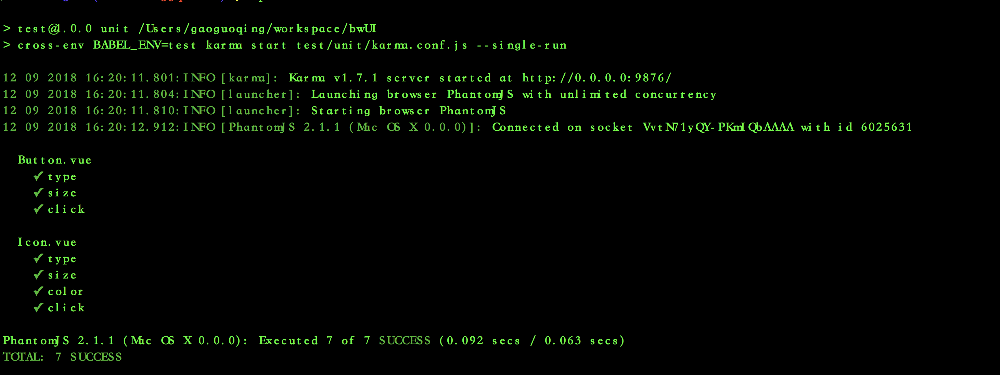

# 组件开发规范【持续补充中。。】

----

### 建议

在开始组件库开发之前，至少要先阅读并且练习一遍 vue的一些[基础知识](https://cn.vuejs.org/v2/guide/),以及遵守 vue 的开发
[风格指南](https://cn.vuejs.org/v2/style-guide/)

### 组件样式
所有组件样式不建议用 scoped 属性，而是添加统一前缀 【$css-prefix-组件名-属性的模式】，以下是组件样式示例：
组件所有的颜色要用颜色表里的变量名来写，便于以后定制化 UI。

// page组件  示例
```bash
$css-prefix-page: $css-prefix + 'page';

.#{$css-prefix-page} {
  font-size: 0;
  .#{$css-prefix-page}-item-content {
    color: $Content;
  }
  .#{$css-prefix-page}-arrow {
    color: $Content;
    &:hover {
      color: $LightPrimary;
    }
  }
}
```

### 开发规范
- 所有组件的`组件名`、`样式名`均以`prefix`为公用前缀，不要用`bw-`，组件库不要和业务相关，就是单纯的组件库,示例
```bash
    <div :class="[prefixCls + '-simple-pager']" :title="currentPage + '/' + pageCount">
        <input
            type="text"
            :value="currentPage"
            @keydown="keyDown"
            @keyup="keyUp"
            @change="keyUp">
        <span>/</span>
        {{ pageCount }}s
    </div>
    ...
    import { prefix } from '../../utils/common'

    const prefixCls = prefix + 'page'
    ...
    wrapCls () {
        return [
            `${prefixCls}`,
            `${prefixCls}-normal`,
            {
                [`${this.className}`]: !!this.className,
                [`${prefixCls}-mini`]: !!this.mini
            }
        ]
    }
```
- 每一个组件要单独拉一个分支管理，比如 `page` 组件的分支名为 `release-ggq-page`,方便以后迭代更新。
### 测试
初期 UI 测试采用常见的的Karma + Mocha单元测试，测试用例请参考test/unit/specs/Icon.spec.js,测试用例编写以后，执行 npm run unit 进行测试

以下是测试用例执行成功的截图


